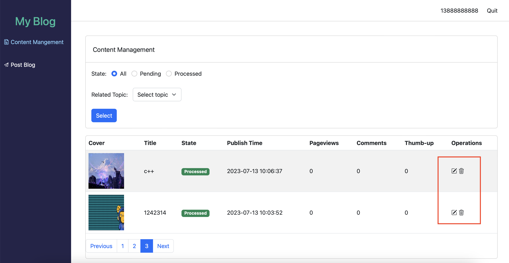
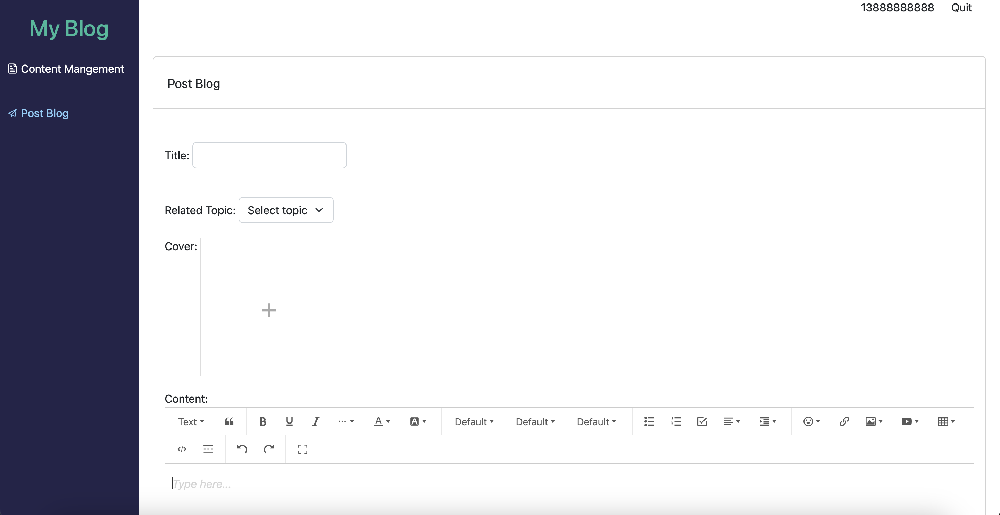

# MyNews-Data-Management-Platform

## Introduction
This is a ToB(to business) platform. It is for blog managers to do CRUD operations to manage blogs users publish.

## Function Realization
1. Login Page:
    
    Due to it is a Internal management platform, it only has login page. Blog managers can login by phone number and backend will send verify code to the phone.
2. Content Page:
    - Content Mangement Page:
        
        Blog manager can edit and delte blogs by operations highlighted by the red box above. Blog manager can also manage blogs by category and state.
    - Post Blog Page:
        
        In this page, blog managers can post and edit blogs.
